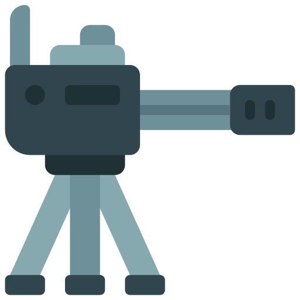

# Loons Tower Defense

Welcome to my implementation of the 'Loons Tower Defense game!  Featuring a React and Phaser frontend, this game operates on a custom WebSocket backend that I developed, offering dynamic difficulty adjustment with each wave, with additional scoring and inventory features.

## Game Overview

"Loons Tower Defense" is a single-player strategy game where players strategically place turrets to defend against waves of 'Loons'. 

### Turrets and Loons

- **BasicTurret**: Can burst BasicLoons. Worth 100 points. 

  

- **AdvancedTurret**: Can burst both BasicLoons and AdvancedLoons. Worth 200 points. 

    

- **BasicLoon**: Constitutes of 90% of the total wave 'loon count. 

   
- **AdvancedLoon**: Constitutes of 90% of the total wave 'loon count.
   
     

### Special Features

- **Dynamic Difficulty**: Increases with each wave.
- **Scoring System**: Based on the number of waves played.
- **In-Game Economy**: Players earn coins, with a bonus after every 10 waves.

### Game End Condition

The game ends if any loon escapes the play area's upper boundary.

## Custom WebSocket Backend

Instead of using the provided pub-sub RPC model, I developed a custom WebSocket backend for real-time gameplay, interactions, and dynamic difficulty adjustments.

## Getting Started

### Prerequisites

- [**React**](https://react.dev/): A JavaScript library for building user interfaces. It will be used as part of your project's dependencies.
- [**Node.js**](https://nodejs.org/): A JavaScript runtime environment. Required for using npm. Recommended version: 14.x or higher. [Download Node.js](https://nodejs.org/)
- **npm**: Comes bundled with Node.js and is used for managing JavaScript dependencies.
- [**Python**](https://www.python.org/downloads/): A powerful programming language that is easy to learn and use. Recommended version: 3.8 or higher.
- **Django**: A high-level Python Web framework. Ensure you have Django 3.1 or higher. Install Django using pip: `pip install django`
- [**Phaser**](https://phaser.io/): A framework for Canvas and WebGL powered browser games. It will be included in your project's npm dependencies.

### Installation

1. Clone the repository.
2. Install Node.js and Python dependencies.
3. Set up environment configurations.

### Running the Game

Follow the instructions in the [backend README](backend/README.md) and the [frontend README](frontend/README.md) to start the backend and frontend servers, respectively.

The game is also currently hosted on this [url](https://loons-td.netlify.app/). Since the backend is not remotely hosted, please make sure that the server is running on port 8000, using the methods mentioned in the [backend README](backend/README.md). 

## Final Notes

### Bugs and Issues
There are no know bugs currently but here are some talking points in terms of the implementation:
1. The end game mechanics currently just check if the loons escape from the top boundry. This can be further improved and made extensible.
2. Current usage of ws and http is not ideal and usage of TLS certificates would be great once the API is deployed.
3. The scoring and buying mechanism has server side checks, so client side exploitation will most probably be avoided.
4. The difficulty scaling is embedded into code right now and could be separated into config, with the user chosing how they want to play.
5. Currently the websocket server is tightly coupled with the HTTP server because it calls service methods to increment score and coin updates. This would need to be changed if we want to separate these servers.

### Architectural Improvements
(In case my game becomes an overnight success)
1. The current implementation of the game is not very scalable. The game is currently hosted on a single server and the game state is persisted in a local SQLite Database. Here are some considerations solely related to scalability:

   - For better scalability we would require the backend to be hosted on an Virtual Machine scaleset or a container orchestration solution like K8S and then be put behind a load-balancer that supports WebSockets.
   -  A hosted scalable database would be nice. We would ideally prefer a SQL-like database for future integrations where we could have leaderboards or fast changing player attributes that need consistency. A lot of NoSQL databases might also provide suitable consistency guarentees so this is debatable.
   -  Redis is being used because of Django channels, but the redis is again hosted on the same backend server. If the number of concurrent connections is very high we would need to deploy a seperate Redis Cluster.
2. Given the usage of WebSockets and how expensive they are it would make sense to deploy the Http and Websocket server separately. Perhaps the initial usage of a pub-sub model makes sense for scalability.
3. Usage of vanilla WebSockets also means that if the connection is lost then the game is over, which could be frustrating for the player. To avoid this we coul duse a higher abstraction like SignalR that takes care of reconnection and has fallback mechanisms. 
---

